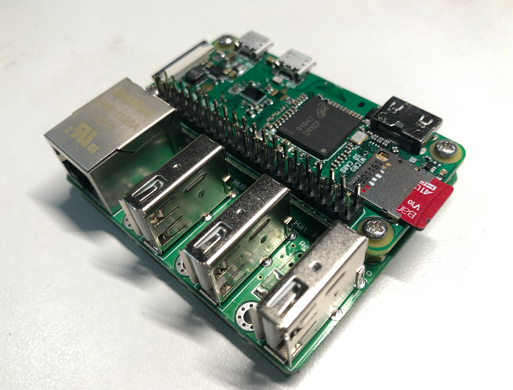

# 说明

用于树莓派自动安装 autossh 服务的脚本



## 准备

- 树莓派硬件
  - raspberry pi zero w
  - raspberry 扩展卡，带以太网卡
- [下载](https://www.raspberrypi.org/downloads/raspberry-pi-os/) 可用的 Rasbian 镜像
- 本地（macOS）安装了 Ansible
- 有一台公网可 ssh 访问的服务器，jump server

## 执行

将 sd card 插入电脑，查下盘符：

```properties
diskutil list
```

然后配置./copy-to-image.sh，运行这个脚本：

- 将 raspbian 镜像写入 sd card
- 在 sd card 打开远程 ssh 访问

将 sd card 插入 raspberry pi zero，连接到具备 dhcp 的以太网网络环境中。

启动 raspberry pi zero。

默认情况下，可以通过 raspberrypi.local 找到该主机：

```properties
ping raspberrypi.local
```

在电脑上能 ping 通后，配置

- ./run.sh，可以加上`-vvvv`作为调试用
- ./vars.yaml，跳板机和 raspberry 主机参数等
- ./hosts.ini，配置跳板机域名和登录用户名
- 本地要设置~/.ssh/config，将用户公钥加入跳板机 ssh 配置，能免密码登录跳板机

执行./run.sh

运行需要较长时间。

结束后登录树莓派检查 autossh service 状态：

```properties
sudo systemctl status autossh.service
```

## 使用

配置~/.ssh/config，通过 jump server ssh 访问树莓派

```
host _RASPBERRY_HOSTNAME
HostName localhost
Port FORWARD_PORT
User pi
ProxyCommand ssh -A -W %h:%p JUMP_SERVER
```

登录：

```properties
ssh _RASPBERRY_HOSTNAME
```

## 参考

- https://github.com/giuaig/ansible-raspi-config/blob/master/raspi-config.yml
  - 可参考编写 ansible-playbook
